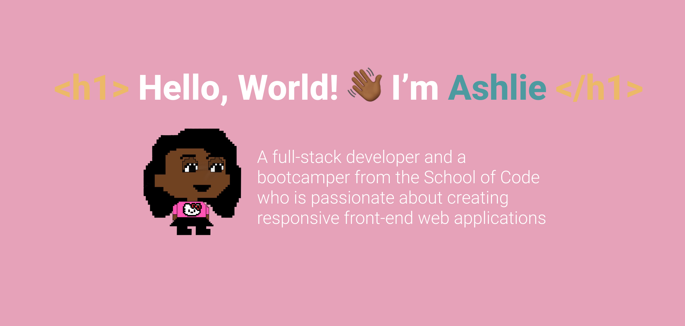

- 💁🏾‍♀️ I'm a London based full-stack developer
- 🌱 I’m currently learning JavaScript, Node, PostgreSQL, React and Next.js
- 🌱 I’m currently learning JavaScript, Node, SQL, React and Next.js with the School of Code
- 👯 I’m looking to collaborate on any project that'll allow me to learn and experiment!
- 📫 How to reach me: @ashliecodes on twitter!
- 😄 Pronouns: she/her
- ⚡ Fun fact(s): I love roller-skating and baking! I also used to work in the legal industry

## 💼 Technical Skills 

   

### 🤝 Connect with me:
<a href="www.linkedin.com/in/ashlie-p-a0131317a">

 

<!--
**ashliecodes/ashliecodes** is a ✨ _special_ ✨ repository because its `README.md` (this file) appears on your GitHub profile.

Here are some ideas to get you started:

- 🔭 I’m currently working on ...
- 🌱 I’m currently learning JavaScript, React and Next.js
- 👯 I’m looking to collaborate on ...
- 🤔 I’m looking for help with ...
- 💬 Ask me about ...
- 📫 How to reach me: ...
- 😄 Pronouns: She/her
- ⚡ Fun fact: I love roller-skating and baking!

-->
